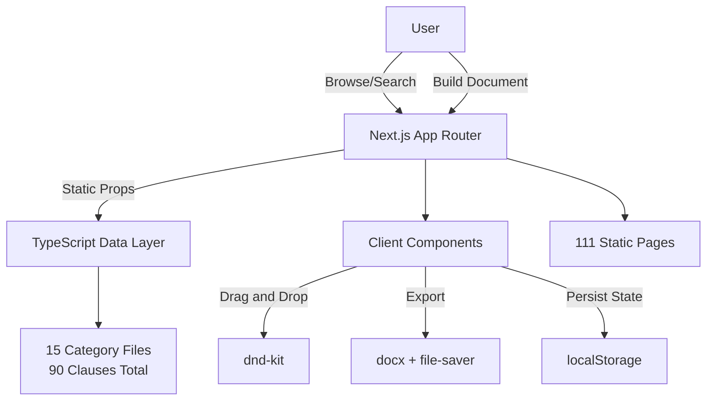
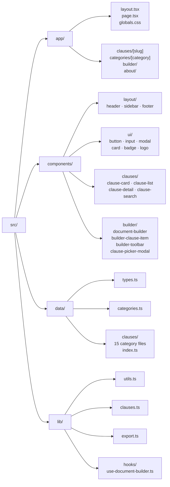
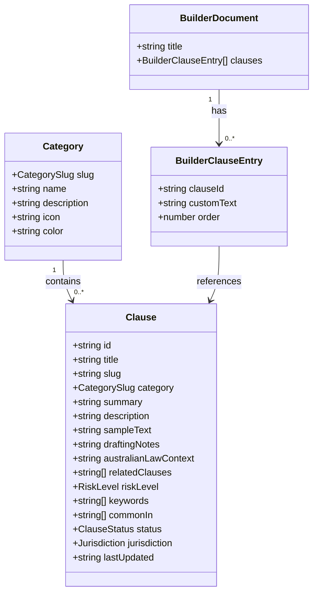
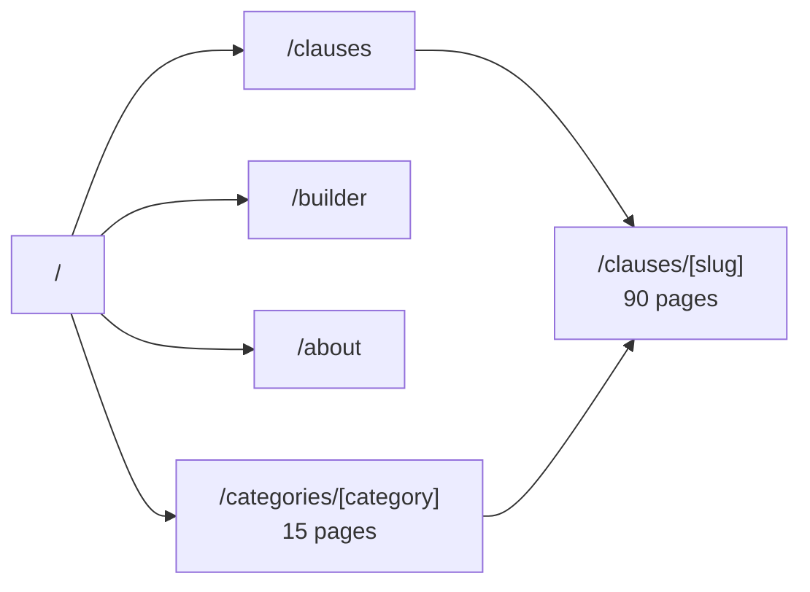
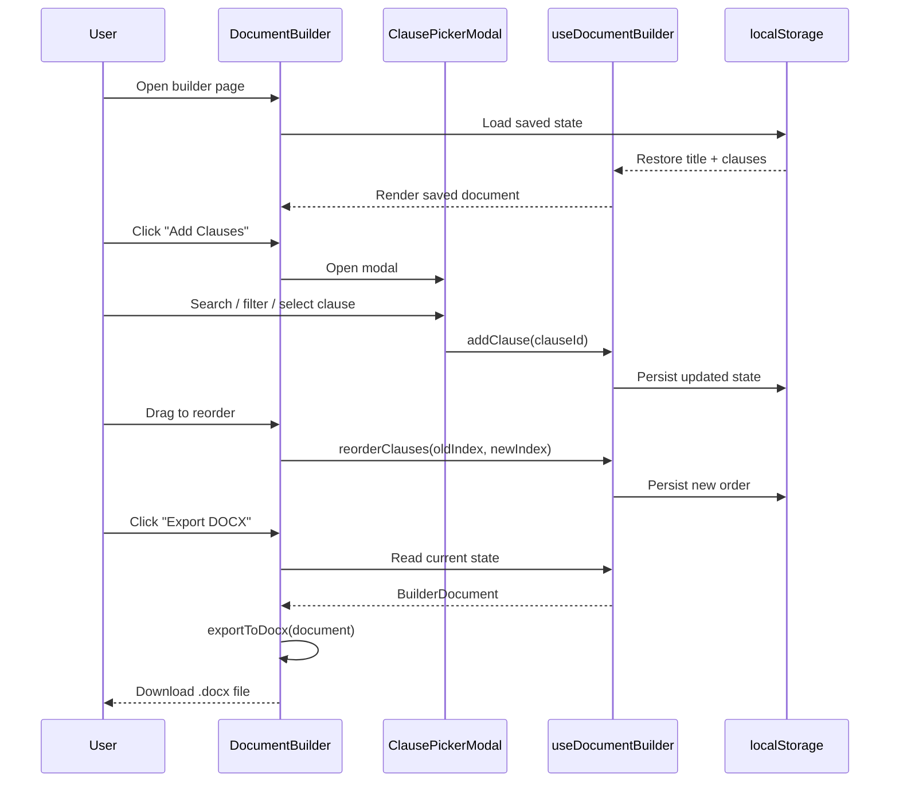
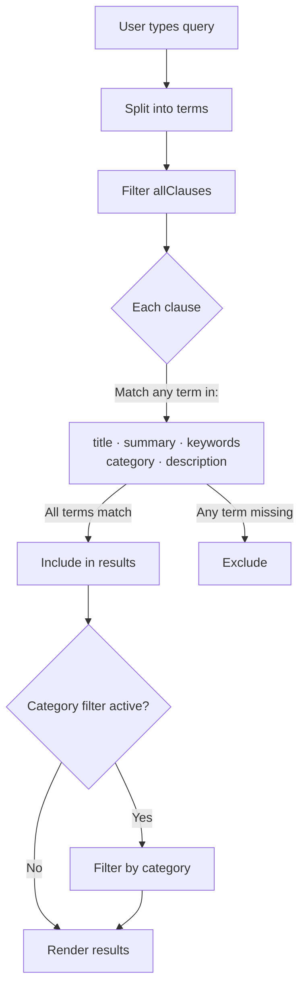

# ClauseVault

> An Australian contract clause library with drag-and-drop document builder.

ClauseVault is an educational legal-tech tool for browsing, searching, and assembling contract clauses drafted for Australian commercial agreements. Built with Next.js 16, Tailwind CSS v4, and static TypeScript data — no database required.

**Legal Disclaimer:** This resource does not constitute legal advice. All clause samples are for general educational purposes only. Always consult a qualified legal practitioner before using any clause in a binding agreement.

---

## Features

- **90 clauses** across 15 categories, drafted for Australian law
- **Full-text search** across titles, summaries, keywords, and categories
- **Category filtering** with colour-coded category badges
- **Clause detail pages** with sample text, drafting notes, and Australian law context
- **Drag-and-drop Document Builder** — reorder clauses, edit text inline
- **DOCX export** — download assembled documents with legal disclaimer footer
- **localStorage persistence** — builder state survives page refresh
- **Mobile responsive** — collapsible sidebar with hamburger menu
- **Fully static** — 111 pre-rendered pages, no backend needed

---

## Tech Stack

| Layer | Choice |
|-------|--------|
| Framework | Next.js 16 (App Router) |
| Language | TypeScript |
| Styling | Tailwind CSS v4 |
| Icons | lucide-react |
| Drag & Drop | @dnd-kit/core + @dnd-kit/sortable |
| DOCX Export | docx + file-saver |
| Font | Outfit (Google Fonts) |
| Data storage | TypeScript files (no database) |

---

## Getting Started

```bash
# Install dependencies
npm install

# Run development server
npm run dev
# → http://localhost:3000

# Production build
npm run build
```

---

## Architecture

### High-Level Overview



### Project Structure



### Data Model



### Page Routing



### Document Builder Flow



### Search & Filter Logic



---

## Clause Categories

| # | Category | Slug | Key Legislation |
|---|----------|------|-----------------|
| 1 | Compliance | `compliance` | Corporations Act 2001, CCA 2010 |
| 2 | Data Protection | `data-protection` | Privacy Act 1988, APPs |
| 3 | Dispute Resolution | `dispute-resolution` | Commercial Arbitration Acts |
| 4 | Employment | `employment` | Fair Work Act 2009 |
| 5 | Finance | `finance` | GST Act 1999, Corporations Act 2001 |
| 6 | General | `general` | General contract law |
| 7 | Insurance | `insurance` | Insurance Contracts Act 1984 |
| 8 | Intellectual Property | `intellectual-property` | Patents Act 1990, Copyright Act 1968 |
| 9 | Liability | `liability` | ACL ss 54–64, CCA s64A |
| 10 | Miscellaneous | `miscellaneous` | Electronic Transactions Act 1999 |
| 11 | Performance | `performance` | ACL, general contract law |
| 12 | Real Estate | `real-estate` | State property legislation |
| 13 | Sales & Marketing | `sales-and-marketing` | CCA Part IV, Franchising Code |
| 14 | Security | `security` | Privacy Act 1988 APP 11 |
| 15 | Warranties | `warranties` | ACL consumer guarantees |

Each clause includes:
- Plain English summary
- Sample clause text (Australian drafting style)
- Drafting notes (how to customise)
- Australian law context (relevant statutes and principles)
- Risk level (low / medium / high)
- Related clause cross-references

---

## Colour System

| Token | Value | Usage |
|-------|-------|-------|
| `--color-primary` | `#1e3a5f` | Deep navy — brand, headings, primary buttons |
| `--color-primary-hover` | `#16304f` | Button hover state |
| `--color-primary-light` | `#e8eef6` | Subtle navy tint for active backgrounds |
| `--color-accent` | `#2563eb` | Vivid blue — links, active nav, CTAs |
| `--color-accent-hover` | `#1d4ed8` | Accent hover |
| `--color-accent-light` | `#eff6ff` | Light tint for selected states |
| `--color-bg` | `#f8fafc` | Page background |
| `--color-surface` | `#ffffff` | Card / panel surfaces |
| `--color-border` | `#e2e8f0` | Default borders |

---

## Adding New Clauses

1. Open `src/data/clauses/<category>.ts`
2. Add a new object to the exported array following the `Clause` interface in `src/data/types.ts`
3. The clause will automatically appear on all relevant pages — no other changes needed

Example:
```typescript
{
  id: "general-new-clause",
  title: "My New Clause",
  slug: "my-new-clause",
  category: "general",
  summary: "One sentence plain English summary.",
  description: "What this clause does and when to use it.",
  sampleText: `The parties agree that [insert clause text here].`,
  draftingNotes: "Notes on customisation.",
  australianLawContext: "Relevant Australian legislation and principles.",
  relatedClauses: [],
  riskLevel: "low",
  keywords: ["keyword1", "keyword2"],
  commonIn: ["Service agreements", "Consultancy agreements"],
  status: "standard",
  jurisdiction: "AU",
  lastUpdated: "2025-01-01",
}
```

---

## Legal Notices

- All clause samples are for **educational purposes only**
- They do not constitute legal advice
- No solicitor-client relationship is created by use of this resource
- Always consult a qualified Australian legal practitioner before use
- The author accepts no liability for loss arising from reliance on this content

---

## License

MIT
